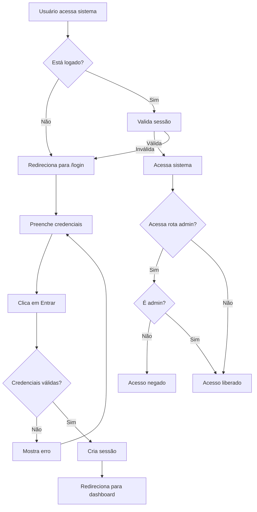

# 🔐 Sistema de Controle de Acesso - Vale do Boi

## 📋 Visão Geral

Este documento descreve a implementação completa do sistema de controle de acesso para o sistema Vale do Boi, incluindo autenticação de usuários, controle de permissões e gerenciamento de usuários.

## 🗄️ Banco de Dados

### 1. Criar Tabela de Usuários
Execute o script `create_usuarios_table.sql` no seu banco de dados PostgreSQL:

```sql
-- Este script cria a tabela usuarios e insere um admin padrão
```

### 2. Criar Funções de Autenticação
Execute o script `create_auth_functions.sql` para criar as funções necessárias:

```sql
-- Este script cria as funções para autenticação e hash de senhas
```

## 🚀 Configuração do Frontend

### Dependências Necessárias
Certifique-se de que as seguintes dependências estão instaladas:

```bash
npm install react-router-dom lucide-react react-currency-input-field
npm install @supabase/supabase-js
```

## 🔑 Credenciais Padrão

**Usuário Admin Padrão:**
- **Email:** `admin@valedoboi.com.br`
- **Senha:** `admin123`

> **⚠️ IMPORTANTE:** Altere essas credenciais após o primeiro login em produção!

## 👤 Tipos de Usuário

### Administrador
- ✅ Acesso total ao sistema
- ✅ Gerenciar outros usuários
- ✅ Criar/editar/inativar usuários
- ✅ Alterar permissões

### Operador
- ✅ Acesso às funcionalidades operacionais
- ❌ Não pode gerenciar usuários
- ❌ Não pode alterar configurações de sistema

## 🛡️ Funcionalidades de Segurança

### Autenticação
- ✅ Login com email e senha
- ✅ Validação de credenciais
- ✅ Controle de sessão
- ✅ Logout automático por inatividade (8 horas)

### Autorização
- ✅ Proteção de rotas
- ✅ Controle de acesso por tipo de usuário
- ✅ Verificação de permissões em tempo real

### Segurança de Dados
- ✅ Senhas hasheadas com bcrypt
- ✅ Tokens de sessão seguros
- ✅ Validação no frontend e backend

## 📱 Interface do Usuário

### Tela de Login
- Interface moderna e responsiva
- Validação de campos em tempo real
- Mensagens de erro claras
- Opção de mostrar/ocultar senha

### Header do Sistema
- Informações do usuário logado
- Menu dropdown com opções
- Botão de logout
- Design responsivo

### Gerenciamento de Usuários (Admin)
- Lista de usuários em cards
- Formulário para criar/editar usuários
- Controle de status (Ativo/Inativo)
- Filtros e busca

## 🔧 Como Usar

### Para Desenvolvedores

1. **Executar Scripts SQL**
   ```bash
   # No seu cliente PostgreSQL/Supabase
   # Execute os arquivos SQL na ordem:
   # 1. create_usuarios_table.sql
   # 2. create_auth_functions.sql
   ```

2. **Iniciar Aplicação**
   ```bash
   npm start
   ```

3. **Primeiro Login**
   - Acesse: `http://localhost:3000/login`
   - Use as credenciais padrão
   - Será redirecionado para o dashboard

### Para Administradores

1. **Fazer Login**
   - Use as credenciais de administrador
   - Sistema verificará automaticamente as permissões

2. **Gerenciar Usuários**
   - Acesse "Gerenciar Usuários" no menu lateral
   - Crie novos usuários operadores
   - Edite informações existentes
   - Ative/desative usuários conforme necessário

3. **Alterar Senha**
   - No formulário de edição de usuário
   - Digite a nova senha (deixe em branco para manter atual)

## 🗂️ Estrutura de Arquivos

```
src/
├── components/
│   ├── Login/
│   │   ├── Login.tsx
│   │   └── Login.css
│   ├── GerenciarUsuarios/
│   │   ├── GerenciarUsuarios.tsx
│   │   └── GerenciarUsuarios.css
│   ├── ProtectedRoute/
│   │   └── ProtectedRoute.tsx
│   ├── Layout/
│   │   ├── Layout.tsx (modificado)
│   │   └── Layout.css (modificado)
│   └── Sidebar/
│       ├── Sidebar.tsx (modificado)
│       └── Sidebar.css
├── contexts/
│   └── AuthContext.tsx
├── services/
│   └── authService.ts
└── App.tsx (modificado)
```

## 🔄 Fluxo de Autenticação



## 🚨 Tratamento de Erros

### Erros Comuns e Soluções

1. **"Email ou senha incorretos"**
   - Verificar credenciais digitadas
   - Confirmar se usuário está ativo

2. **"Usuário inativo"**
   - Contatar administrador para reativar

3. **"Erro de conexão"**
   - Verificar conexão com banco de dados
   - Confirmar configuração do Supabase

4. **"Acesso negado"**
   - Usuário operador tentando acessar área admin
   - Solicitar permissão ao administrador

## 🔧 Manutenção

### Backup de Usuários
```sql
-- Fazer backup da tabela usuarios
pg_dump --table=usuarios sua_database > backup_usuarios.sql
```

### Logs de Acesso
- Todos os logins são registrados no console
- Erros de autenticação são logados
- Considere implementar logs de auditoria em produção

## 📞 Suporte

Para dúvidas ou problemas:
1. Verificar este documento
2. Consultar logs do console do navegador
3. Verificar logs do servidor/banco de dados
4. Contatar o desenvolvedor responsável

---

**Desenvolvido para Vale do Boi - Sistema de Gestão de Transporte**  
*Implementação: Sistema de Controle de Acesso v1.0* 